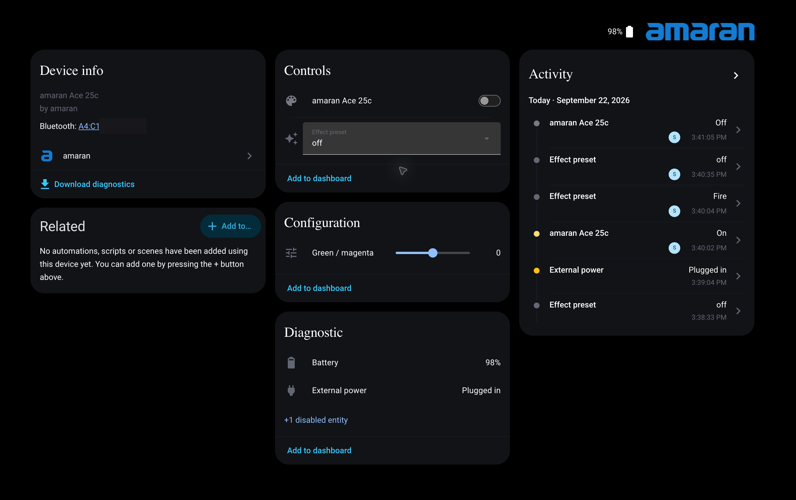

# amaran for Home Assistant

Give your amaran lights Wi-Fi control through Home Assistant. Adjust the
lighting, choose an effect, and use them in your home automations!



## What you can control

Available controls depend on your light:

- Power and brightness.
- White light temperature, including the wider CCT+ range on supported models.
- Color and green/magenta tint.
- Built-in effects such as Fire, Lightning, TV, and Cop car.
- Battery level and whether external power is connected.

Restarting Home Assistant leaves your lights as they are.

## Setup

You'll need Home Assistant with HACS, plus a Mac or Windows
computer with Python 3 and amaran Desktop installed. Your lights should already
be added to amaran Desktop.

This integration needs a Bluetooth connection to the lights. If your Home Assistant machine doesn't have Bluetooth, is too far from the lights, or you often move your lights around, use an [ESPHome Bluetooth Proxy](https://esphome.io/components/bluetooth_proxy/) near the lights.

### 1. Install the integration

1. Open HACS, then open **Custom repositories** from its menu.
2. Add `https://github.com/neyako/amaran-hacs` and choose **Integration**.
3. Download **amaran** and restart Home Assistant.

### 2. Export your lights

Run the command below on the computer where you use amaran Desktop. It reads
your saved lights and creates the setup information Home Assistant needs.

**macOS:** open Terminal and run:

```bash
curl -fsSL https://raw.githubusercontent.com/neyako/amaran-hacs/refs/heads/main/scripts/export_amaran.py | python3 - | pbcopy
```

The result is copied to your clipboard, ready to paste.

**Windows:** open PowerShell and run:

```powershell
irm https://raw.githubusercontent.com/neyako/amaran-hacs/refs/heads/main/scripts/export_amaran.py | py - --output amaran-export.json
```

Open `amaran-export.json` from the folder where you ran the command and copy
its contents.

**Close amaran Desktop before continuing. Keep it closed while controlling
your lights from Home Assistant, as it can interfere with the connection.**

### 3. Add your lights

1. In Home Assistant, go to **Settings > Devices & services > Add integration**.
2. Search for **amaran** and choose the import option.
3. Choose JSON import and paste your export. Leave the advanced settings alone.
4. Select the lights you want to add and submit.

Each selected light gets its own entry. You can reuse the export later to add
lights you skipped, or run the export again after adding new lights to Desktop.

## Using your lights

Open a light's device page to find its controls. Color lights with supported
effects have an **Effect preset** dropdown under **Controls**. Select a preset
and use the light's brightness control to adjust it.

Choose **off** in the dropdown to return to steady lighting. Use the light's
power switch to turn it off completely.

On supported battery-powered lights, **Diagnostic** shows the battery level
and **External power**. **Plugged in** means a power source is connected. It
doesn't tell you whether the battery is still charging or already full.

## Supported lights

These models have been tested or reported working by users. The table lists
the controls checked so far, rather than every control available in the app.

| Light | Checked controls |
| --- | --- |
| Ace 25c | Brightness, white temperature, color, tint, 12 effects, battery, and external power |
| T4c | Brightness, white temperature, color, tint, and 15 effects |
| Pano 60c | Brightness, white temperature, and color |
| 60x S, 100x, 100x S | Brightness and white temperature |
| Verge Max | Brightness and white temperature |
| Halo 60x | Reported working ([Issue #6](https://github.com/neyako/amaran-hacs/issues/6)) |
| Ray 120c | Brightness, white temperature, and tint ([Issue #7](https://github.com/neyako/amaran-hacs/issues/7)) |

Other models are recognized using the light information bundled with amaran
Desktop 1.1.03. Color controls are enabled for all 19 amaran models listed as
supporting them, including Ray 60c, 120c, 360c, and 660c. Not every model has
been tested with this integration yet.

Pano 60c/120c and all four Ray models offer a wider white temperature range of
1800 to 20000 K. That extended range still needs testing on real lights.

## A few things to know

- Ace 25c accepts RGB colors, but doesn't reliably report the exact color back.
  Home Assistant keeps the color you selected.
- Effects labeled **II** or **III** still need testing on real lights. Custom
  pixel effects, music effects, and detailed effect settings aren't included.
- Changes made on the light may take around 30 seconds to appear in Home
  Assistant. Battery and plug status update about once a minute.

If you run into a problem or want to add your light to the supported list, [open an issue](https://github.com/neyako/amaran-hacs/issues) with your light model and Home Assistant version.

## Credits

Built with help from the research and tools in
[wesbos/amaran-BLE-control](https://github.com/wesbos/amaran-BLE-control) and
[theontho/amaran-cli](https://github.com/theontho/amaran-cli).
